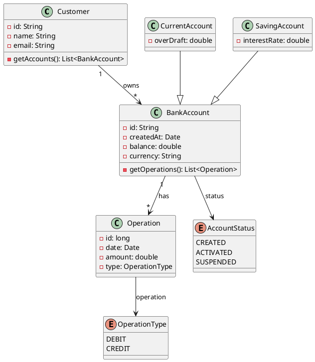
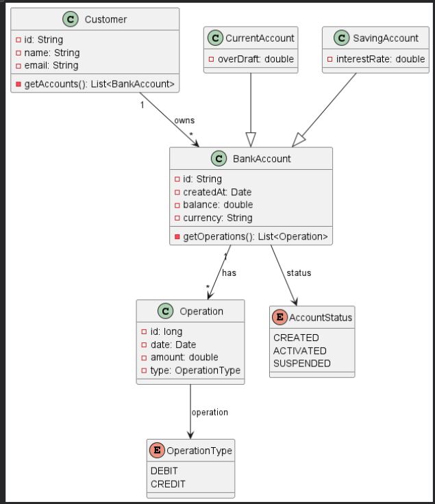

# Digital Banking

## Video of Execution
Please refer to 

```plantuml
@startuml
class Customer {
    -id: String
    -name: String
    -email: String
    -getAccounts(): List<BankAccount>
}

class BankAccount {
    -id: String
    -createdAt: Date
    -balance: double
    -currency: String
    -getOperations(): List<Operation>
}

class CurrentAccount{
    -overDraft: double
}
class SavingAccount{
    -interestRate: double
}

CurrentAccount --|> BankAccount
SavingAccount --|> BankAccount

class Operation {
    -id: long
    -date: Date
    -amount: double
    -type: OperationType
}

Customer "1" --> "*" BankAccount : owns
BankAccount "1" --> "*" Operation : has

enum OperationType {
    DEBIT
    CREDIT
}

enum AccountStatus {
    CREATED
    ACTIVATED
    SUSPENDED
}

BankAccount --> AccountStatus : status
Operation --> OperationType : operation
@enduml
```

## Screenshot

## FrontEnd Report
Please refer to

## BackEnd Report
Please refer to
