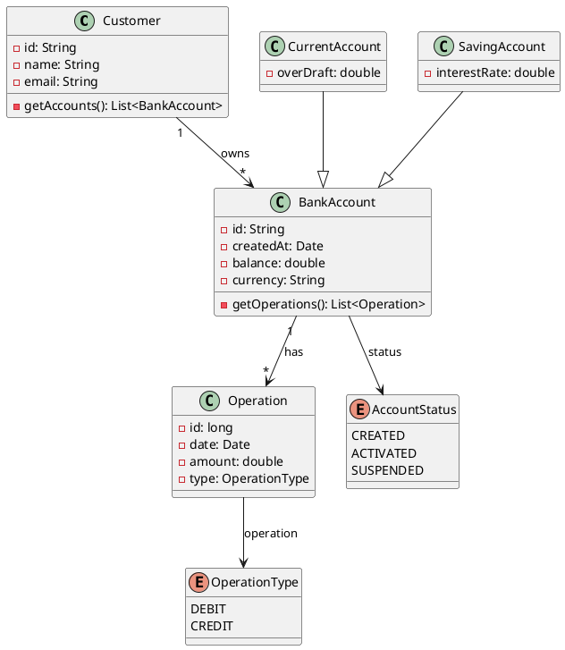

# Digital Banking

## Video of Execution

https://github.com/user-attachments/assets/613cc9e7-77c4-4740-8588-0a443d5648d0

### ClassDiagram

## Screenshot

## FrontEnd Report
Please refer to 
- [FrontEnd Report](https://github.com/ENSET-JEE-DS/DigitalBankingFrontEnd/blob/main/README.md)

## BackEnd Report
Please refer to
- [BanckEnd Report](https://github.com/ENSET-JEE-DS/DigitalBanking/blob/NewMain/Code/DigitalBankingApplication/README.md)

